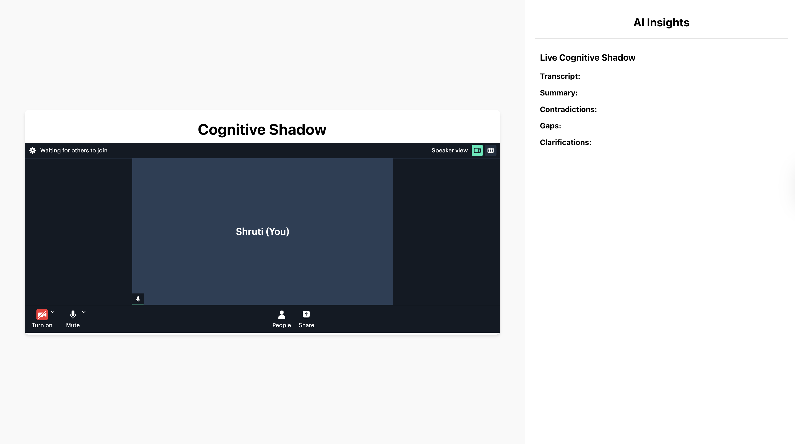

**An AI-Powered Real-Time Meeting Shadow** – transcribes conversations, generates summaries, detects contradictions, identifies cognitive gaps, and raises clarifying questions during meetings.

---

## Features  

- **Real-time transcription** (Whisper)  
- **LLM-based reasoning**: summaries, action items, contradictions, gaps, clarifications (Ollama, Phi3)  
- **Cloud storage**: S3 (audio, transcripts), DynamoDB (metadata)  
- **Live video call integration** (Daily.co)  

## Screenshots  



## How to run:
This is a local version of a web meeting platform which has an AI companion that transcribes, summarises, analyses, and suggests points of discussion. It can prove useful when scaled further.

### Requirements:
```
pip install requirements.txt
```

### Launch FastAPI:
In a terminal, run: 
```
uvicorn app:app --reload --port 5000
```

### Start the webapp:
In a new terminal, run:
```
npm start
```